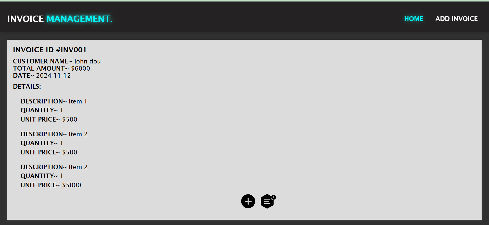
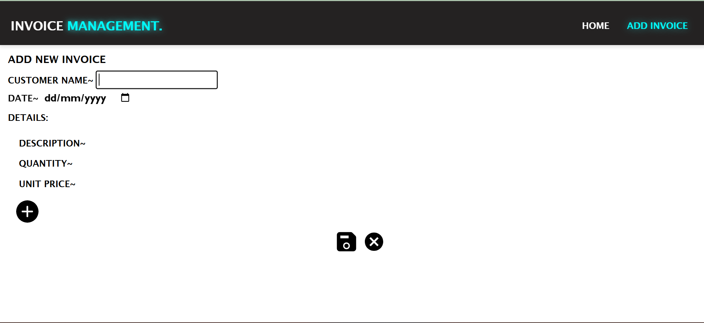

Welcome to the Invoice Management System.

Below is the Home Page of the invoice system,Having features to update and delete invoice


Below is the Add New Invoice Page



# Invoice Frontend

This is the **frontend** of the **Invoice Management System** built with **React.js**, **Redux**, and **Axios**. It interacts with a **Django** backend to manage invoices.

## Table of Contents
- [Installation](#installation)
- [Usage](#usage)
- [Folder Structure](#folder-structure)
- [Tech Stack](#tech-stack)
- [Features](#features)
- [Contributing](#contributing)
- [License](#license)

---

## Installation

### Prerequisites:
- **Node.js** (version 14.x or higher)
- **npm** or **yarn**

To set up the frontend, follow these steps:

1. Clone the repository:
    ```bash
    git clone https://github.com/yourusername/invoice-frontend.git
    ```
2. Navigate to the project directory:
    ```bash
    cd invoice-frontend
    ```
3. Install the dependencies:
    ```bash
    npm install
    # or
    yarn install
    ```

---

## Usage

### Running the Development Server

After installing the dependencies, you can run the React app in development mode:

```bash
npm start
# or
yarn start
/src
  /assets           # Static files like images, icons, etc.
  /components       # Reusable UI components (Buttons, Inputs, etc.)
  /features         # Feature-specific components (InvoiceList, CreateInvoice, etc.)
  /redux            # Redux slices, reducers, and actions
  /services         # Functions to make API requests using Axios
  /styles           # Global CSS and theme files
  App.js            # Root component that renders the main app
  index.js          # Entry point of the React app
/public
  index.html        # HTML template file
.gitignore          # Specifies files and folders to be ignored by git
package.json        # Project metadata and dependencies
README.md           # Project documentation
LICENSE             # Project License (if applicable)
Tech Stack
Frontend Framework: React.js
State Management: Redux
API Requests: Axios (for HTTP requests)
Routing: React Router
Styling: (Optional) Tailwind CSS or custom styles
Features
View Invoices: Display a list of invoices with customer details, amounts, and invoice information.
Create Invoice: A form to create new invoices with customer name, details, and amounts.
Update Invoice: Modify existing invoices, including customer details and invoice information.
Responsive UI: Designed to be mobile-friendly and work on both desktop and mobile devices.
State Management: Redux is used to manage global state for invoices, loading states, and error handling.
Contributing
We welcome contributions! To contribute to this project:

Fork the repository.
Create a new branch (git checkout -b feature-branch).
Make your changes.
Commit your changes (git commit -am 'Add new feature').
Push to your fork (git push origin feature-branch).
Open a pull request.


### Key Details:
- **Frontend Setup**: Focused solely on setting up the React app, managing dependencies, and running the development server.
- **Tech Stack**: Highlighted **React**, **Redux**, **Axios**, and other relevant tools.
- **Contributing Guidelines**: Standard guidelines for contributing to the project.

This README file ensures that anyone looking to set up and run your React frontend can do so easily.
